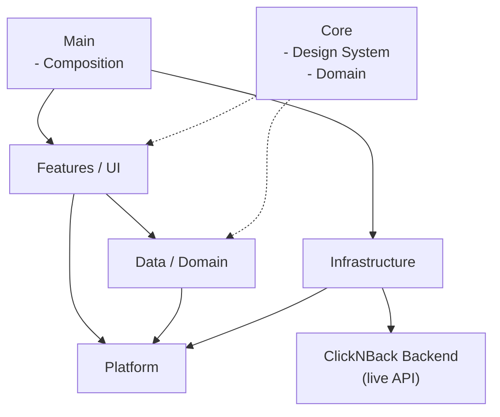

# ClickNBack iOS


[](https://github.com/jerosanchez/clicknback-ios/actions/workflows/ci.yml)
[](https://developer.apple.com/xcode/)
[](https://swift.org)
[](https://developer.apple.com/ios/)

This is the native iOS client for **ClickNBack** — a production-grade cashback platform built from the ground up with zero shortcuts. Users earn rewards on purchases at partner merchants; this app lets them authenticate, browse active offers, track their purchase history, and monitor their wallet balance. It is **not a standalone demo** — it talks to a real, continuously deployed backend ([clicknback.com](https://clicknback.com/docs)) over HTTPS with JWT authentication, the same API a production app would consume. Every architectural decision, from strict layer isolation to concurrency safety, was made to match the standards expected at a company shipping a financial product to real users.

---

## The Platform

ClickNBack models how a real cashback product works: the platform ingests purchase events, verifies them asynchronously (simulating bank reconciliation), calculates cashback, manages user wallets with pending and available balances, and processes withdrawals. The backend is live, continuously deployed, and open for technical review.

| | |
| --- | --- |
| **Backend repo** | [github.com/jerosanchez/clicknback](https://github.com/jerosanchez/clicknback) |
| **Live API docs** | [clicknback.com/docs](https://clicknback.com/docs) |
| **Stack** | FastAPI · PostgreSQL · JWT · Python 3.13 |
| **CI gate** | Lint + tests (85 % coverage hard gate) + security scanning on every commit |

The iOS app is the mobile face of that platform. It connects to the same production API that a real merchant cashback app would use.

---

## App Features

| Screen | Description |
| --- | --- |
| **Splash** | App entry point — resolves authentication state and routes accordingly |
| **Onboarding** | First-run flow introducing the app's value proposition and guiding account creation |
| **Sign In** | JWT-based authentication against the live ClickNBack API |
| **Home** | Authenticated landing screen — navigation hub for the main sections |
| **Offers** | Browse active cashback offers from partner merchants; register a purchase against an offer to earn cashback (purchase ingestion) |
| **Purchases** | View purchase history and cashback status per transaction |
| **Wallet** | Real-time wallet summary — pending, available, and paid-out balances; request a simulated payout (withdrawal) |
| **Profile** | User profile and account management |

---

## Architecture

The app follows **Clean Architecture + MVVM** with a strict inward dependency rule — no layer imports types from an outer layer. `Main/Composition/` is the single place where layers are wired together via constructor injection.



### Layer responsibilities

| Layer | Location | Responsibility |
| --- | --- | --- |
| **Features / UI** | `ClickNBack/Features/` | SwiftUI views + ViewModels; no business logic |
| **Data / Domain** | `ClickNBack/Data/` | Use cases, repository protocols, business models, typed errors |
| **Infrastructure** | `ClickNBack/Infra/` | Remote repository implementations, API clients, storage adapters |
| **Platform** | `ClickNBack/Platform/` | Cross-cutting protocols only — AnalyticsTracker, Logger, API Client, KeyValueStorage, FeatureFlagEvaluator etc. |
| **Core / Design System** | `ClickNBack/Core/` | System Design tokens, domain (primitive) models |
| **Main / Composition** | `ClickNBack/Main/` | The only place layers meet - Composition Root, app startup |

---

## Tech Stack

| Concern | Choice |
| --- | --- |
| **Language** | Swift 6 — strict concurrency enabled project-wide |
| **UI framework** | SwiftUI (100 %) — targeting iOS 26.0+ |
| **Concurrency** | `async/await` only — no Combine, no callbacks |
| **Actor isolation** | `@MainActor` applied globally (`SWIFT_DEFAULT_ACTOR_ISOLATION = MainActor`) |
| **State management** | `@Observable` (Swift Observation framework) — no `ObservableObject` |
| **Networking** | `URLSession`-based `PublicAPIClient` behind the `APIClient` protocol |
| **Project management** | [Tuist](https://tuist.dev) — declarative `Project.swift` generates the Xcode project; configuration as code ensures consistency across environments; never edit `project.pbxproj` by hand |
| **Testing** | Swift Testing (`import Testing`, `#expect`, `@Suite`, `@Test`) — never XCTest |
| **Linting / formatting** | SwiftLint · SwiftFormat |
| **CI** | GitHub Actions — build + lint + tests on every push |

---

## Getting Started

### Prerequisites

- **macOS** with **Xcode 26.4+** installed (not just Command Line Tools)
- **Homebrew** — [brew.sh](https://brew.sh)

> **No backend setup needed.** The app connects to the live API at `clicknback.com` out of the box.

### First-time setup

Clone the repository and run the one-command setup:

```sh
git clone https://github.com/jerosanchez/clicknback-ios.git
cd clicknback-ios
make install
```

`make install` installs all required developer tools (`tuist`, `swiftformat`, `swiftlint`, `markdownlint-cli` via Homebrew) and regenerates the Xcode project from `Project.swift`.

### Open and run

```sh
make open   # opens ClickNBack.xcworkspace in Xcode
```

1. Select the **`ClickNBack-Dev`** scheme
2. Choose a simulator (default: iPhone 17)
3. Press **Run (▶)**

---

## Contributing

See [CONTRIBUTING.md](CONTRIBUTING.md) for setup, workflow, available AI skills, development commands, and best practices.

---
